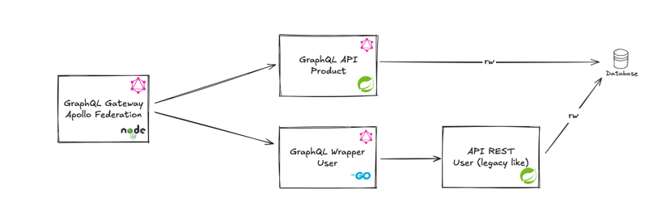

# Apollo Federation Gateway Example

This project demonstrates a microservices architecture using Apollo Federation. It integrates:

- **Apollo Gateway (Node.js)**: Central federated GraphQL gateway.
- **Golang GraphQL Wrapper**: Converts legacy REST APIs (Spring Boot) to federated GraphQL.
- **Spring Boot GraphQL API**: GraphQL-based product management service.

